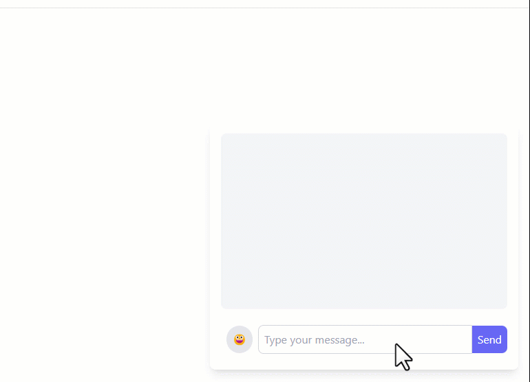

## Simple Real Time Chat Application

###  Chat Application with React (Vite), TailwindCSS, Node, Socket.io & Express 

---




```bash
/client
npm run dev

/server
npm run dev
```

Open [http://localhost:5173/](http://localhost:5173/) in your browser to view the project.


---

##### Contact with me:

[][linkedin]

[linkedin]: https://www.linkedin.com/in/sergiy-antonyuk/
